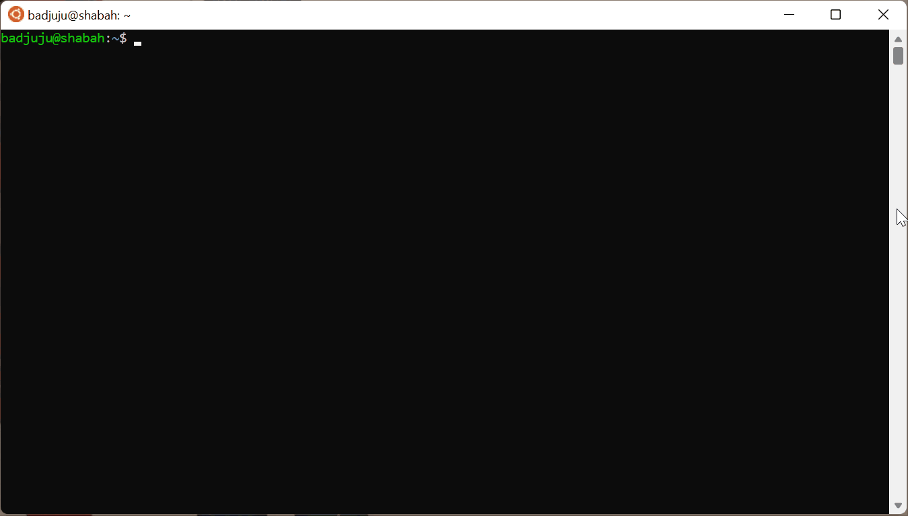
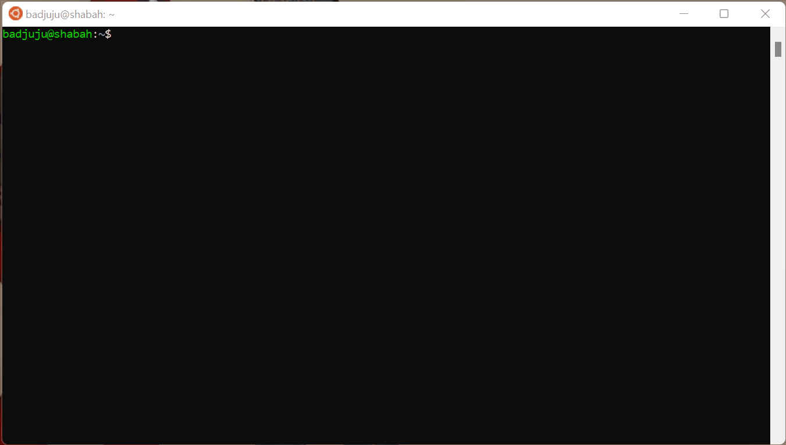

# About
A Linux shell program. The shell interprets command lines. It can invoke built-in functions and run programs that exist on the machine. The shell implements a handful of operators that are described later in this document. Written in C.

# Demo
#### Interactive Mode

Here's what's happening:
1. `./jshell` runs the shell's executable.
2. `ls` displays the files in the current directory. This command is NOT implemented by the shell. It is used to demo that the shell can look for commands on the system and execute them.
3. `environ` is a built-in shell command that displays all environment variables.
4. `echo hi! > myfile` writes the string 'hi!' to a new file named 'myfile'. This demonstrates that the redirection operator (>) works. See the [OPERATORS](#operators) section for more information about shell operators.
5. `cat myfile` displays the content of 'myfile' to demonstrate that step #4 worked.
6. `cat sample` displays the content of 'sample'. This is helpful for the next step.
7. `cat sample | grep demonstrate` shows that the piping operator works. `grep` is a program that prints the lines of a file that match a pattern. The pattern in this case is 'demonstrate.' The file to be searched is 'sample', because of the piping operator. For more details about the pipe operator, see the [OPERATORS](#operators) section.

#### Batch Mode

Here's what's happening:
1. `ls` is used to display the files that are used in the demo. Those files are: 
    - 'batch_file': a file containing commands to be run by the shell in order.
    - 'in': a file used in the third command of 'batch_file'.
    - 'jshell': the shell's binary (executable).
2. `cat batch_file` is used to display the commands that are in the batch file. The commands are:
    - `ls -la`: displays all the files (including hidden files) that are in the current directory, in detail.
    - `echo hello!`: displays the string 'hello!'.
    - `cat < in > out`: reads the content of the file 'in' and writes it to a new file called 'out'. 'out' is created or overwritten by this command.
3. `cat in` is used to display the contents of the file 'in'.
4. `./jshell batch_file` runs the shell program with newline-separated commands from 'batch_file'.
5. `ls` displays the contents of the current directory. This is to verify that the last command of 'batch_file' succeeded in creating a new file named 'out'.
6. `cat out` displays the content of the file 'out'. This is to verify that the last command of 'batch_file' succeeded in writing the contents of 'in' to 'out'.

**NOTE** Only step 4 uses the functionality of 'jshell'. All other commands are interpreted by Bash, and are NOT part of the demo.

# How To Run
* Install GNU Make (v4.2.1)
* Install GCC (v9.4.0)
* Clone the repo
* Open a terminal
* Switch to the 'src' directory of this repo
* Enter the command 'make'. This will compile the program
* Enter './jshell'

After following the instructions above, you have a running shell. Refer to the [documentation](#documentation) for details about using the shell.

**NOTE:** The version numbers in parenthesis are not a requirement. However, those are the versions that were used in development and testing.

# Documentation
#### NAME
jshell - A simple shell program

#### SYNOPSIS
jshell [batch_file]

#### DESCRIPTION
jshell is a basic shell, its primary use is to take user commands and execute them.
Most commands are programs that live on the system, the shell simply finds and runs
those programs. Commands that are not executables on the system are built-in shell functions.
Those commands are part of the shell program and their functionality is implemented in functions.
Please see the [BUILT-INS](#built-ins) section for information about shell built-ins.

jshell uses two different modes: 
INTERACTIVE - Continuously prompts for commands until user exits 
BATCH - Uses a text file to execute commands, commands are newline-separated 

#### OPERATORS
Operators tell the shell how to run a program. By default, most programs run
using the keyboard as input and the screen as output. The redirection operators
(>, >>, <) allow us to change that default behavior. Moreso, the pipe operator (|)
allows us to send a program's output to another program's input.

By default, the shell waits on the command to finish executing before prompting
another command. The background processing operator (&) lets us change that.
Say you have a program which runs for a long period of time. You may want to run it
and continue working on the shell. That can be achieved using (&). Another useful
aspect of background processing is that you get to run multiple programs simultaneously!
How cool is that?

The shell supports 5 different operators: 
| OPERATOR | DESCRIPTION |
| :---: | --- |
| \> | Writes the output of a program to a specified file on the system. If the file doesn't exist, it is created. If the file exists, it is overwritten. |
| \>> | Same as above, except that if the file exists, output is added to the end of the file. |
| \< | Program will take input from a specified file rather than keyboard. |
| \| | Program to the left side of this operator will dump its output in a space in memory that is accessible to the program on the right side of this operator. The program to the right reads the output of the program to the left and uses it as input. |
| \&	| Program runs in the background. Shell will run the program then return immediately to take more commands. |

#### COMMAND SYNTAX
`program [args] [>> OR > <filename>] [< <filename>] [| <program2>] [& [<program2>]]` 

program:  name or path of an executable, or otherwise name of a shell built-in 
args:     the arguments specific to the program, optional for some commands 
filename: name of the file that is the new input or output file, used in
       		 conjunction with \>>, \>, \< 
program2: another command that can also follow the same syntax above 

**NOTE:** A second command on the same line can only be run after a '|' or '&' operator, otherwise ONLY one command can be run at a time. When using the '|' operator, a second command MUST be entered. However, when using the '&' operator, a second command is optional.
        
#### COMMAND EXAMPLES
When executing, the shell prints the following prompt: `[/home/user]:jshell> ` 
The string between square brackets is the current working directory. 
To run a command, first enter its name, then enter its arguments (if needed), followed by optional shell operators.

`[/home/user]:jshell> echo hello world!` 
hello world! 

`[/home/user]:jshell> ls > out` 
The ls command with no args lists contents of the current working directory,
when used with the operator '>' it sends the output to a file called 'out' 

`[/home/user]:jshell> program1 & program2 &` 
Runs both program1 and program2 in the background 

`[/home/user]:jshell> program1 & program2` 
Runs program1 in the background, but waits for program2 to finish (foreground) 

`[/home/user]:jshell> cat < in > out` 
Reads contents of 'in' and writes them to 'out' 

`[/home/user]:jshell> cat file | grep hello` 
Sends the contents of 'file' to the program 'grep' which searches the file for lines that include the word 'hello'. If matching lines are found, they are printed 

#### BUILT-INS
The shell supports a few built-in commands (commands that are not executables on the system, but rather implemented in the shell program.)

- cd \<directory> 
Changes the current working directory to \<directory>, if no arguments are present, the directory isn't changed

- clr 
Clears the screen

- dir \<directory> 
List contents of \<directory> if that argument is present, otherwise list contents of current working directory

- environ 
List all environment variables and their corresponding values

- echo \<comment> 
Print \<comment>. If \<comment> starts with '$', search the environment for a variable named \<comment>, excluding the '$'. 
Example: 'echo $PWD' searches the environment for PWD and displays its value if it exists

- help 
Display the user manual, essentially this document

- pause 
Pause shell operation until the ENTER key is hit

- quit 
Quits the shell

#### BATCH
Batch mode is not much different from interactive mode. Call the shell executable the following way:

`jshell batch`

Where 'jshell' is the path to the shell executable and 'batch' is the file to read commands from.

The structure of batch is as follows: 
command1 
command2 
command3 

The commands must be newline-separated.
Each command follows the same syntax described in [COMMAND SYNTAX](#command-syntax).
If a failure occurs while executing any of the commands, the shell is terminated.

Sample batch file:
******************
ls -la 
echo hello! 
cat < in > out 
******************
